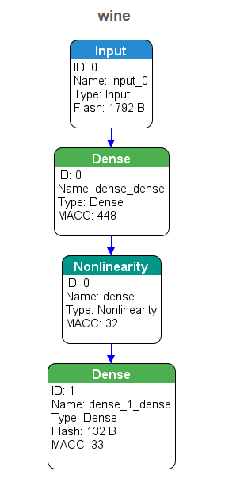
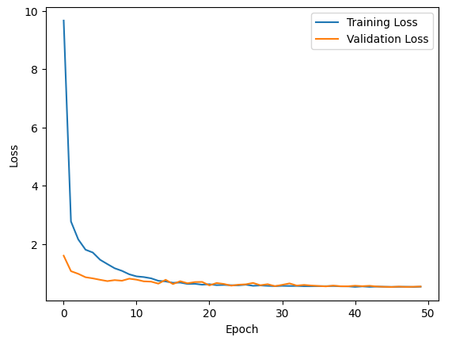

# wine_embedded_AI

# Projet de Qualité du Vin

## Description du Projet
Ce projet vise à prédire la qualité du vin en utilisant un modèle de réseau de neurones profond. Nous avons utilisé un ensemble de données contenant divers paramètres chimiques du vin et avons construit un modèle pour prédire la qualité du vin basée sur ces paramètres.

## Prétraitement des Données
### Nettoyage des Données
- Les valeurs manquantes ont été imputées en utilisant la médiane pour les variables numériques et le mode pour les variables catégorielles.
- Les variables catégorielles ont été transformées en utilisant l'encodage One-Hot.

### Ingénierie des Caractéristiques
- Des techniques d'ingénierie des caractéristiques ont été appliquées pour créer de nouvelles caractéristiques pertinentes.
- La standardisation a été appliquée aux caractéristiques numériques.

## Architecture du Modèle
Nous avons construit un modèle de réseau de neurones profond avec l'architecture suivante:
- Couche d'entrée avec 64 neurones et une fonction d'activation ReLU.
- Une couche Dropout avec un taux de 0.5 pour réduire le surajustement.
- Couche cachée avec 32 neurones et une fonction d'activation ReLU.
- Couche de sortie avec 1 neurone.

## Entraînement du Modèle
Le modèle a été entraîné avec une fonction de perte MSE et un optimiseur Adam pendant 50 époques.

## Résultats
### Graphiques de Performance
Voir `loss_x_epoch.png` pour la courbe de perte d'entraînement et de validation au fil des époques. Cette courbe nous aide à comprendre comment notre modèle apprend et s'il y a un surajustement.

### Commentaires sur les Graphiques
- Les valeurs de perte sur l'ensemble de validation sont relativement basses, ce qui indique que le modèle généralise bien aux données non vues.
- Il n'y a pas de signes évidents de surajustement, car les courbes de perte d'entraînement et de validation sont assez proches l'une de l'autre.

### Résultats Numériques
Les valeurs de perte et de MAE à chaque époque sont indiquées ci-dessus dans le message. La perte et la MAE sur l'ensemble de validation sont relativement basses, indiquant une bonne performance du modèle.

# Projet de Qualité du Vin

## Description du Projet
Ce projet vise à prédire la qualité du vin en utilisant un modèle de réseau de neurones profond. Nous avons utilisé un ensemble de données contenant divers paramètres chimiques du vin et avons construit un modèle pour prédire la qualité du vin basée sur ces paramètres.

## Prétraitement des Données
### Nettoyage des Données
- Les valeurs manquantes ont été imputées en utilisant la médiane pour les variables numériques et le mode pour les variables catégorielles.
- Les variables catégorielles ont été transformées en utilisant l'encodage One-Hot.

### Ingénierie des Caractéristiques
- Des techniques d'ingénierie des caractéristiques ont été appliquées pour créer de nouvelles caractéristiques pertinentes.
- La standardisation a été appliquée aux caractéristiques numériques.

## Architecture du Modèle
Nous avons construit un modèle de réseau de neurones profond avec l'architecture suivante:
- Couche d'entrée avec 64 neurones et une fonction d'activation ReLU.
- Une couche Dropout avec un taux de 0.5 pour réduire le surajustement.
- Couche cachée avec 32 neurones et une fonction d'activation ReLU.
- Couche de sortie avec 1 neurone.

## Entraînement du Modèle
Le modèle a été entraîné avec une fonction de perte MSE et un optimiseur Adam pendant 50 époques.

## Résultats
### Graphiques de Performance
Voir `loss_x_poch.png` pour la courbe de perte d'entraînement et de validation au fil des époques. Cette courbe nous aide à comprendre comment notre modèle apprend et s'il y a un surajustement.

### Commentaires sur les Graphiques
- Les valeurs de perte sur l'ensemble de validation sont relativement basses, ce qui indique que le modèle généralise bien aux données non vues.
- Il n'y a pas de signes évidents de surajustement, car les courbes de perte d'entraînement et de validation sont assez proches l'une de l'autre.

### Résultats Numériques
Les valeurs de perte et de MAE à chaque époque sont indiquées ci-dessus dans le message. La perte et la MAE sur l'ensemble de validation sont relativement basses, indiquant une bonne performance du modèle.

